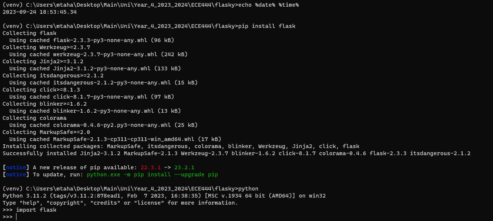
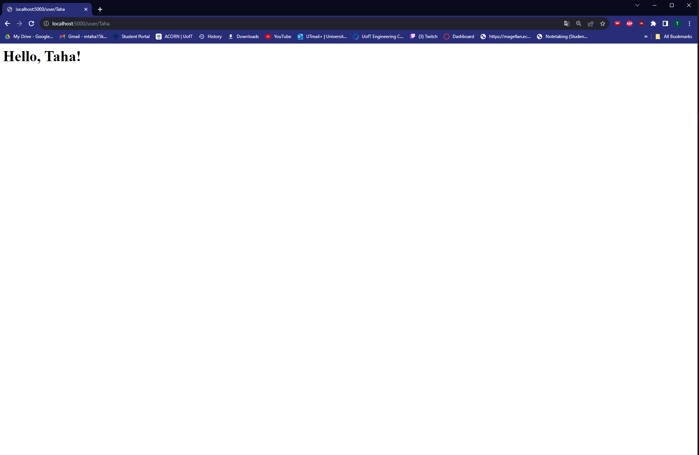
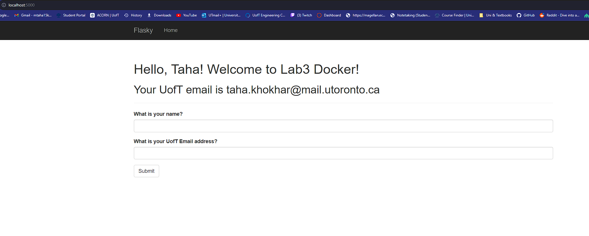
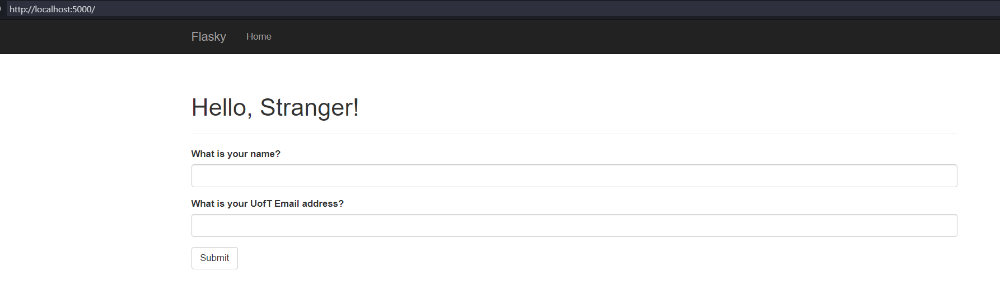
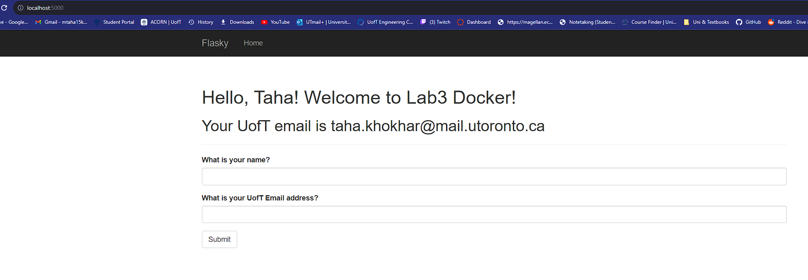
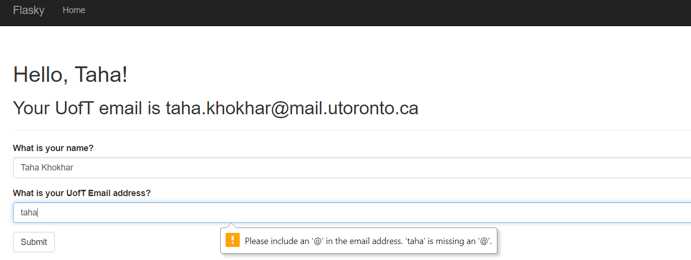
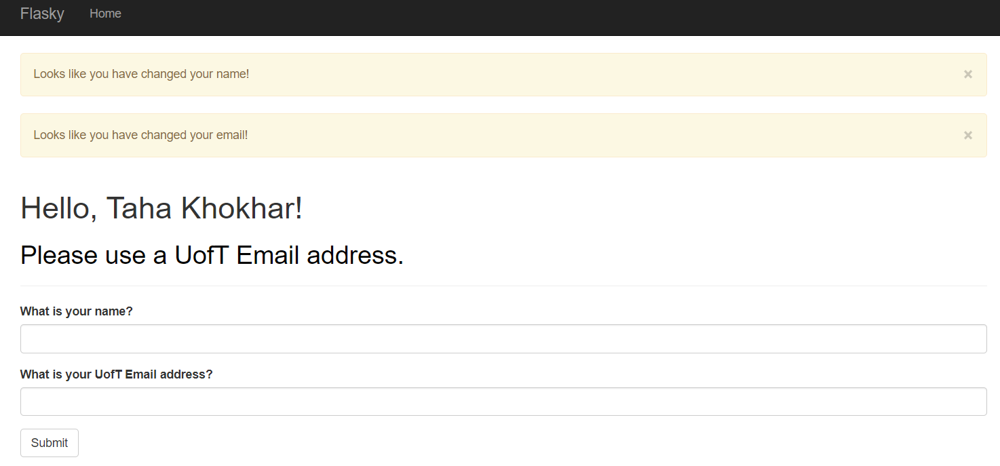

# ECE444-F2023-Lab1

This repository is a clone of [this original repository](https://github.com/miguelgrinberg/flasky).

## Activity 1: Installation

## Activity 2: Simple Webpage (Recreating Textbook Example)
    

## Activity 3: Using Templates to Build Webpages

## Activity 4: Forms

